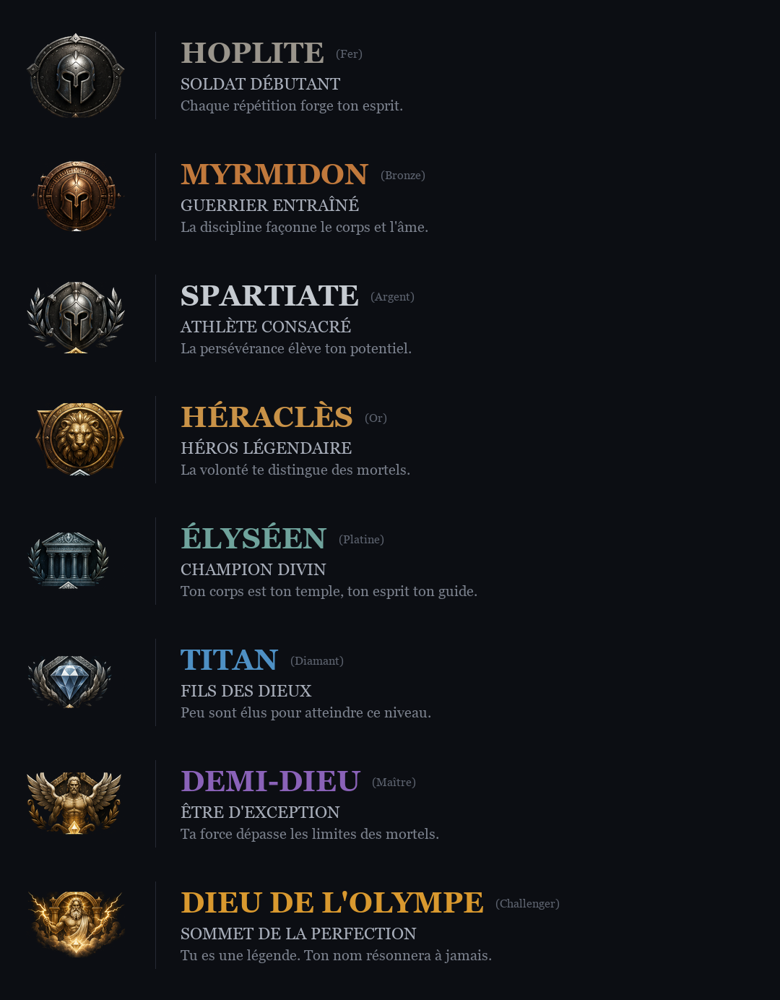

# La Faille

Application web de suivi d'entraînement gamifiée : un programme hebdomadaire personnalisé,
des séances validées qui rapportent des LP, et une progression par rangs inspirée de League
of Legends transposée en mythologie grecque — **Hoplite → Dieu de l'Olympe**.

La spécification complète est dans [SPEC-la-faille.md](SPEC-la-faille.md).

## Démarrer

```bash
docker compose up -d
npm install
cp .env.example .env
npm run db:reset
npm run dev
```

`docker compose up -d` monte PostgreSQL 17 sur le port **5433** — décalé pour ne
pas entrer en conflit avec une instance déjà installée sur la machine. Les
données vivent dans un volume Docker, pas dans le dépôt.

`db:reset` applique les migrations et charge le catalogue (8 équipements,
7 groupes musculaires, 147 exercices). L'app tourne sur http://localhost:3000.

Pour la mettre en ligne : [DEPLOIEMENT.md](DEPLOIEMENT.md).

> Le projet a démarré sur SQLite. La bascule vers PostgreSQL n'a demandé qu'un
> mot dans le schéma — aucune requête SQL brute, aucun type exotique — et c'est
> le préalable à toute app mobile : un téléphone ne peut pas se connecter au
> fichier local d'un PC. Le script `scripts/migration-sqlite-postgres.ts`
> transfère les données d'une base existante.

## Séance hors ligne

Une salle en sous-sol n'a pas de réseau, et c'est précisément là que l'app
sert. L'app mobile tient donc une séance entière sans serveur :

- la séance du jour et le référentiel sont gardés sur le téléphone dès qu'ils
  arrivent, et relus si le serveur ne répond pas ;
- une séance validée sans réseau part en **file d'attente**, et se renvoie
  toute seule à la prochaine ouverture de l'app qui trouve du signal.

La validation différée porte sa date (`faiteLe`) : la séance est enregistrée au
jour où elle a été faite, pas au jour de l'envoi — sinon une séance du soir
remontée le lendemain matin serait refusée, et la salle aurait été faite pour
rien. Le serveur n'accepte **qu'un jour** de recul (`RECUL_MAX_JOURS` dans
[`lib/seance.ts`](lib/seance.ts)) : au-delà, on ouvrirait un rattrapage
rétroactif des jours manqués, que le calendrier refuse délibérément.

Les Δ restent calculés par le serveur, à l'envoi. L'app ne les annonce jamais
d'avance sur une séance en attente : le barème dépend de la régularité et des
bonus déjà comptés ce jour-là, qu'elle ne connaît pas.

> Le stockage local passe par `@react-native-async-storage/async-storage`, un
> **module natif** : une build EAS antérieure à son ajout ne l'embarque pas. Il
> faut donc reconstruire l'app (`npx eas-cli build`) — un rechargement de Metro
> ne suffit pas.

## Tests

```bash
npm test                   # 56 tests unitaires — moteur, barème LP, difficulté. Aucune base.
npm run test:integration   # 164 tests sur une base PostgreSQL dédiée
```

Les tests d'intégration recréent la base `lafaille_test` à chaque exécution et
vérifient, avant d'écrire quoi que ce soit, à quelle base ils sont réellement
connectés.

> Sous Windows, si tu écris le `.env` à la main : **UTF-8 sans BOM**. Un BOM
> casse la lecture de la première clé.

## Connexion Google

L'app n'a pas de mot de passe : l'authentification passe uniquement par Google
(Auth.js v5, sessions stockées en base). Tant que les identifiants ne sont pas
renseignés, la landing affiche un message le disant explicitement plutôt qu'un
bouton mort.

1. Ouvrir la [Google Cloud Console](https://console.cloud.google.com/) et créer
   un projet (ou en sélectionner un).
2. **APIs & Services → OAuth consent screen** : type « External », renseigner
   nom de l'app, e-mail d'assistance et e-mail de contact. Tant que l'app est
   en mode *Testing*, ajouter ton adresse Google dans **Test users** — sans
   ça, Google refuse la connexion avec `access_denied`.
3. **APIs & Services → Credentials → Create credentials → OAuth client ID**,
   type **Web application**.
4. Dans **Authorized redirect URIs**, ajouter exactement :

   ```
   http://localhost:3000/api/auth/callback/google
   ```

5. Copier le client ID et le client secret dans `.env` :

   ```
   AUTH_GOOGLE_ID="…apps.googleusercontent.com"
   AUTH_GOOGLE_SECRET="…"
   ```

6. **Redémarrer `npm run dev`** — Next.js ne recharge pas `.env` à chaud.

`AUTH_SECRET` est déjà généré dans le `.env` local. Pour en régénérer un :
`node -e "console.log(require('crypto').randomBytes(32).toString('base64'))"`.

### Si ça ne marche pas

| Symptôme | Cause habituelle |
|---|---|
| `redirect_uri_mismatch` | L'URI enregistrée ne correspond pas au caractère près — vérifier `http` et non `https`, le port, et l'absence de `/` final |
| `access_denied` | Compte absent des **Test users** de l'écran de consentement |
| Le bouton reste absent | `.env` non rechargé : redémarrer le serveur |
| `invalid_client` | ID ou secret tronqué à la copie |

## Rangs

Les 8 rangs sont définis dans [`lib/ranks.ts`](lib/ranks.ts) — source de vérité unique pour
les noms, sous-titres, descriptions, couleurs d'accent et seuils LP.

| Rang | Palier | LP d'entrée |
|---|---|---|
| Hoplite | Fer | 0 |
| Myrmidon | Bronze | 400 |
| Spartiate | Argent | 800 |
| Héraclès | Or | 1200 |
| Élyséen | Platine | 1600 |
| Titan | Diamant | 2000 |
| Demi-Dieu | Maître | 2400 |
| Dieu de l'Olympe | Challenger | 3000 |



Les écussons (`public/ranks/*.png`, 512×512 transparents) sont découpés depuis
[`docs/planche-rangs-source.png`](docs/planche-rangs-source.png) par
[`scripts/extract-ranks.py`](scripts/extract-ranks.py) :

```bash
python scripts/extract-ranks.py
```

Le script demande `pillow`, `numpy` et `scipy`. Il n'a besoin d'être relancé que si la
planche source change.
